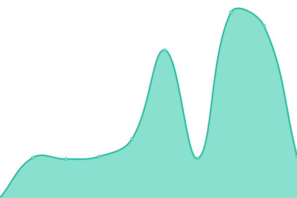
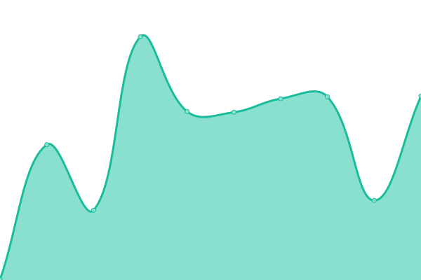
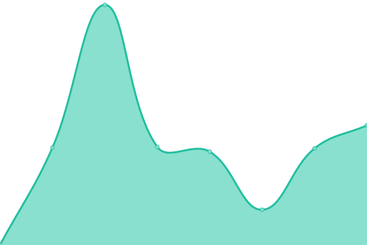
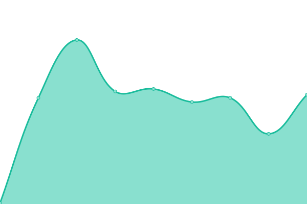
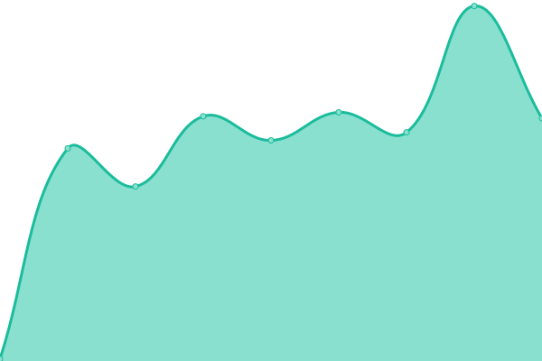
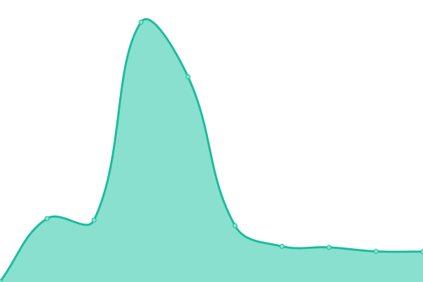
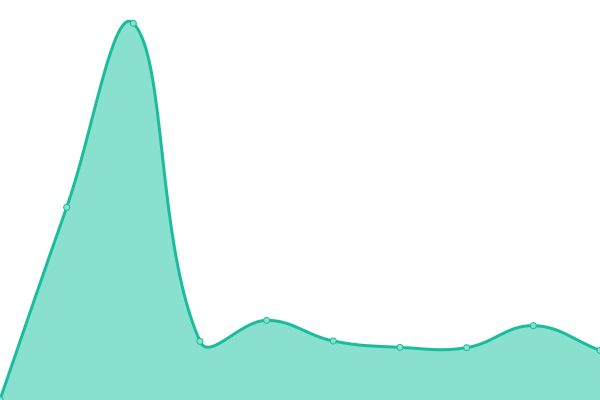
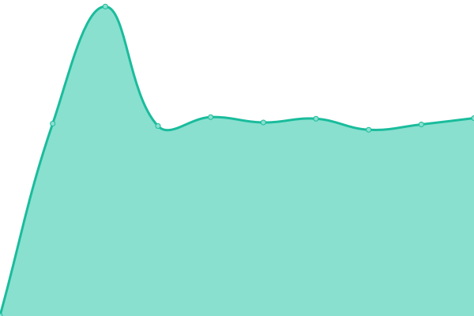
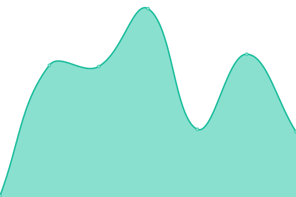
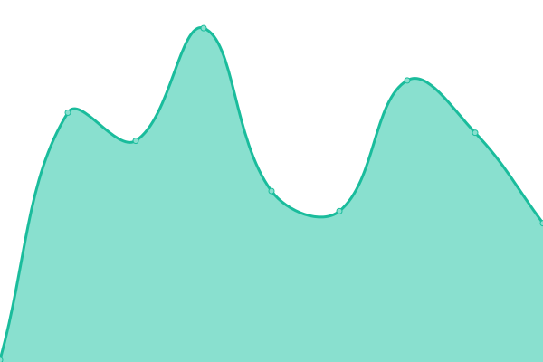

# [📈 Live Status](https://vikas111981.github.io/NGLUptimeMonitor): <!--live status--> **🟩 All systems operational**

This repository contains the open-source uptime monitor and status page for [vikas111981](https://vikas111981.github.io/NGLUptimeMonitor), powered by [Upptime](https://github.com/upptime/upptime).

With [Upptime](https://upptime.js.org), you can get your own unlimited and free uptime monitor and status page, powered entirely by a GitHub repository. We use [Issues](https://github.com/vikas111981/NGLUptimeMonitor/issues) as incident reports, [Actions](https://github.com/vikas111981/NGLUptimeMonitor/actions) as uptime monitors, and [Pages](https://vikas111981.github.io/NGLUptimeMonitor) for the status page.

<!--start: status pages-->
<!-- This summary is generated by Upptime (https://github.com/upptime/upptime) -->
<!-- Do not edit this manually, your changes will be overwritten -->
<!-- prettier-ignore -->
| URL | Status | History | Response Time | Uptime |
| --- | ------ | ------- | ------------- | ------ |
|  [NGL.Com - New Delhi](https://nangilife.com) | 🟩 Up | [ngl-com-new-delhi.yml](https://github.com/vikas111981/NGLUptimeMonitor/commits/HEAD/history/ngl-com-new-delhi.yml) | 

 465ms
     
 | 

<a href="https://status.priv5.site/history/ngl-com-new-delhi">98.46%</a>
    

|  [NGL.Com - Mumbai](https://nangilife.com) | 🟩 Up | [ngl-com-mumbai.yml](https://github.com/vikas111981/NGLUptimeMonitor/commits/HEAD/history/ngl-com-mumbai.yml) | 

 915ms
     
 | 

<a href="https://status.priv5.site/history/ngl-com-mumbai">98.46%</a>
    

|  [NGL.Com - New York](https://nangilife.com) | 🟩 Up | [ngl-com-new-york.yml](https://github.com/vikas111981/NGLUptimeMonitor/commits/HEAD/history/ngl-com-new-york.yml) | 

 435ms
     
 | 

<a href="https://status.priv5.site/history/ngl-com-new-york">98.45%</a>
    

|  [NGL.Com - London](https://nangilife.com) | 🟩 Up | [ngl-com-london.yml](https://github.com/vikas111981/NGLUptimeMonitor/commits/HEAD/history/ngl-com-london.yml) | 

 156ms
     
 | 

<a href="https://status.priv5.site/history/ngl-com-london">98.45%</a>
    

|  [NGL.Com - Berlin](https://nangilife.com) | 🟩 Up | [ngl-com-berlin.yml](https://github.com/vikas111981/NGLUptimeMonitor/commits/HEAD/history/ngl-com-berlin.yml) | 

 86ms
     
 | 

<a href="https://status.priv5.site/history/ngl-com-berlin">98.45%</a>
    

|  [NGL.Online - New Delhi](https://nangilife.online) | 🟩 Up | [ngl-online-new-delhi.yml](https://github.com/vikas111981/NGLUptimeMonitor/commits/HEAD/history/ngl-online-new-delhi.yml) | 

 448ms
     
 | 

<a href="https://status.priv5.site/history/ngl-online-new-delhi">98.45%</a>
    

|  [NGL.Online - Mumbai](https://nangilife.online) | 🟩 Up | [ngl-online-mumbai.yml](https://github.com/vikas111981/NGLUptimeMonitor/commits/HEAD/history/ngl-online-mumbai.yml) | 

 868ms
     
 | 

<a href="https://status.priv5.site/history/ngl-online-mumbai">98.45%</a>
    

|  [NGL.Online - New York](https://nangilife.online) | 🟩 Up | [ngl-online-new-york.yml](https://github.com/vikas111981/NGLUptimeMonitor/commits/HEAD/history/ngl-online-new-york.yml) | 

 400ms
     
 | 

<a href="https://status.priv5.site/history/ngl-online-new-york">98.45%</a>
    

|  [NGL.Online - London](https://nangilife.online) | 🟩 Up | [ngl-online-london.yml](https://github.com/vikas111981/NGLUptimeMonitor/commits/HEAD/history/ngl-online-london.yml) | 

 136ms
     
 | 

<a href="https://status.priv5.site/history/ngl-online-london">98.45%</a>
    

|  [NGL.Online - Berlin](https://nangilife.online) | 🟩 Up | [ngl-online-berlin.yml](https://github.com/vikas111981/NGLUptimeMonitor/commits/HEAD/history/ngl-online-berlin.yml) | 

 123ms
     
 | 

<a href="https://status.priv5.site/history/ngl-online-berlin">98.45%</a>
    

<!--end: status pages-->

[**Visit our status website →**](https://vikas111981.github.io/NGLUptimeMonitor)

## 📄 License

- Powered by: [Upptime](https://github.com/upptime/upptime)
- Code: [MIT](./LICENSE) © [Anand Chowdhary](https://anandchowdhary.com), supported by [Pabio](https://pabio.com)
- Data in the `./history` directory: [Open Database License](https://opendatacommons.org/licenses/odbl/1-0/)
